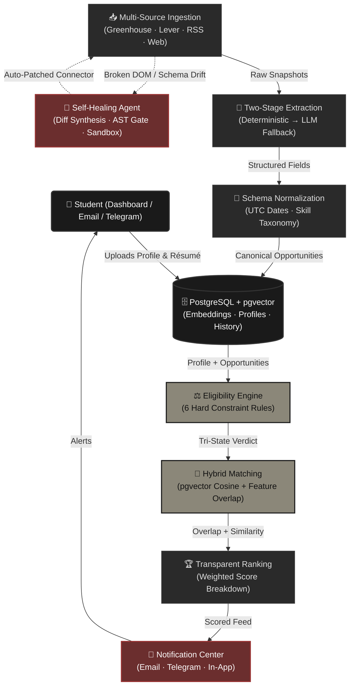
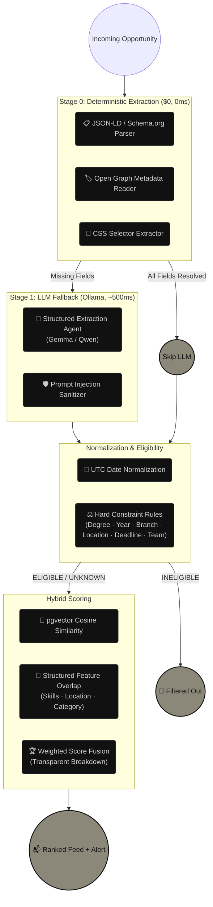

# AEGIS 🛡️

**An autonomous immune system for student opportunity discovery.**

A message pops up in the college Discord: *"Google Summer of Code Extended deadline — apply now, only 48 hours left!"* Students scramble to apply, reshare it, ask peers for help. Half of them miss the original posting. The other half find out that the deadline was yesterday. Nobody knows which listings are legitimate, which are expired, and which match their actual skills.

Every week, the same chaos: internships buried in job boards nobody checks, hackathons found the day after registration closes, fellowship applications scattered across six different platforms. **The opportunity always dies before the student finds it.**

AEGIS treats opportunity discovery as an **autonomous intelligence pipeline, not a manual search.** It continuously ingests listings from Greenhouse, Lever, RSS feeds, and raw web pages; deterministically evaluates eligibility against a student's profile; ranks matches using hybrid vector scoring; and delivers deduplicated, explained alerts — all without a single human click. When a web scraper breaks because a site changed its HTML, AEGIS diagnoses the failure, synthesizes an AST-safe patch, tests it in a sandbox, and heals itself.

> **Quantifiable Impact:** By autonomously scanning, filtering, and ranking opportunities across fragmented sources 24/7, AEGIS saves students an estimated **15+ hours per week** of manual job-board hunting, and ensures zero missed deadlines through proactive notification scheduling with quiet-hours awareness.

---

## 🏛️ System Architecture
AEGIS operates on a layered, pipeline-first architecture. It ingests raw data from multiple source types, runs a two-stage extraction cascade (deterministic first, LLM fallback), normalises everything into a canonical schema, applies hard eligibility constraints before semantic scoring, and dispatches deduplicated alerts — all orchestrated autonomously via Celery Beat scheduling.



---

## 🔬 The Extraction & Matching Pipeline
The pipeline operates exactly how a careful recruiter would: **cheapest checks first.** Deterministic rules eliminate impossible matches before any embedding is computed, and no LLM is ever allowed to decide eligibility.



| Stage | Goal | Description |
|---|---|---|
| **Stage 0** | **Structure First** | Parses JSON-LD, Open Graph, and CSS selectors from raw HTML. Costs nothing, completes instantly. Extracts title, dates, organizer, location, and category deterministically. |
| **Stage 1** | **LLM Fallback** | Invoked *only* when Stage 0 leaves fields empty. Local Ollama model (Gemma/Qwen) structures residual text. Prompt injection defense strips adversarial instructions before any LLM call. |
| **Eligibility** | **Hard Constraints** | Six deterministic rules (degree, year, branch, location, deadline, team size). Output is always ELIGIBLE, INELIGIBLE, or UNKNOWN with evidence. **No LLM ever decides truth.** |
| **Scoring** | **Hybrid Ranking** | pgvector cosine similarity + Jaccard skill overlap + category alignment, fused with configurable weights. Full breakdown stored and displayed — never a black-box number. |

---

## 🔧 Self-Healing Connector Pipeline
Web scrapers break constantly — sites redesign, selectors vanish, schemas drift. AEGIS turns breakage into **automatic recovery.** A broken connector triggers an investigation, patch, validation, and promotion cycle without human intervention (with an optional approval gate).

```mermaid
graph LR
    classDef report fill:#111,stroke:#333;
    classDef strain fill:#8B8779,stroke:#111,color:#111,font-weight:bold;
    
    Fail("🚨 Connector Failure<br/>(Zero Records / Selector Missing)"):::report --> Classify
    Classify("🔍 Failure Classifier<br/>(6 Categories)"):::report --> Synth
    Synth("🤖 LLM Diff Synthesizer<br/>(Minimal Unified Diff)"):::report --> Gate

    Gate(("🛡️ AST Security Gate")):::strain
    Gate -->|"❌ Forbidden Imports / Secrets"| Reject["🚫 Rejected"]
    Gate -->|"✅ Safe Patch"| Sandbox

    Sandbox("🧪 Sandbox Execution<br/>(Isolated Test Run)"):::report --> Promote
    Promote("✅ Auto/Manual Promote<br/>(Feature-Flagged)"):::report --> Healthy["💚 Connector Healthy"]
```



One broken selector detected. One patch synthesized. One sandbox verified. **Zero human hours spent.** The repair agent is scoped to a single connector file — it can never touch business logic, access secrets, or modify the broader codebase. A kill switch (`AEGIS_REPAIR_ENABLED`) instantly disables all autonomous repair.

---

## ✨ Features & Interface
AEGIS features a modular React + TypeScript dashboard with six dedicated views, designed for clarity and zero-click autonomous operation.

- **Profile & Résumé Intelligence:** Drag-and-drop PDF upload, two-stage extraction with confidence badges (≥90% green, 70–89% amber, <70% red), evidence quote popovers, and draft-to-confirmed review workflow.
- **Ranked Opportunity Feed:** Scored cards with tri-state eligibility pills (ELIGIBLE, INELIGIBLE, UNKNOWN), transparent score breakdowns, and fact-grounded explanations citing only stored evidence.
- **Source Registry:** Health-monitored connectors with live badges (HEALTHY green, DEGRADED amber, BROKEN red), connection probes, and source registration.
- **Notification Center:** Multi-channel alerts, SHA-256 idempotency audit, quiet hours scheduling, and one-click test alert triggers.
- **Self-Healing Console:** Repair run audit cards, unified diff viewer, AST validation checklist, and Approve/Reject/Rollback actions.
- **System Health Dashboard:** Live benchmark metrics (Precision/Recall, P@5, P@10), 8-mode chaos resilience status, and interactive evaluation runner.

---

## 🛠️ Tech Stack & Providers
AEGIS deliberately separates AI concerns from truth-deciding logic. LLMs extract and synthesize — **deterministic rules and arithmetic decide eligibility and scores.**

| Layer | Technology / Provider | Role |
|---|---|---|
| **Core Backend** | Python 3.11, FastAPI, Pydantic v2 | REST API, schema validation, health checks, CORS, auth middleware. |
| **Frontend UI** | React, TypeScript, Vite | Six-view dashboard with confidence badges, score breakdowns, and repair console. |
| **Eligibility Engine** | Deterministic Rule Engine | 6 hard constraints evaluated without any LLM. Output: ELIGIBLE / INELIGIBLE / UNKNOWN. |
| **Vector Matching** | PostgreSQL 15 + pgvector | Embedding storage, cosine similarity search, and structured feature overlap. |
| **Scheduling & Queue** | Celery + Celery Beat + Redis | Autonomous per-source cadence scheduling, retry backoff, dead-letter queues. |
| **Extraction & Fallback** | Ollama (Gemma2 / Qwen2.5) | Local LLM for text structuring when deterministic parsing is insufficient. |
| **Web Crawling** | Crawl4AI + Playwright | HTML fetching with SSRF protection, rate limiting, and fixture recording. |
| **Embeddings** | Sentence Transformers | Local open-source embedding generation for semantic similarity scoring. |
| **Self-Healing** | LLM Diff Synthesis + AST Gate | Unified diff patches, AST validation, sandbox test execution, approval gating. |
| **Observability** | OpenTelemetry, Structured JSON Logs | Span tracing, correlation IDs, and structured logging across the pipeline. |
| **Containers** | Docker Compose (Multi-Stage) | Postgres (pgvector), Redis, API, Worker, Beat, Dashboard — one-command stack. |

---

## 🚀 Setup & Installation

### Prerequisites
- Python **3.11+**
- Node.js **v20+** (for the dashboard)
- Docker **24+** & Docker Compose **2.20+** (optional, for containerized setup)

### 1. Clone and Install Backend
```bash
git clone <repository-url> aegis
cd aegis
python -m venv venv
source venv/bin/activate  # On Windows: venv\Scripts\activate
pip install --upgrade pip
pip install -r requirements.txt
```

### 2. Configure Environment
```bash
cp .env.example .env
```
Fill out the `.env` file. Essential keys:
- `DATABASE_URL`: PostgreSQL connection string with pgvector extension enabled.
- `REDIS_URL`: Redis broker URL for Celery task queue.
- `AEGIS_API_KEY`: API authentication key for protected endpoints.
- `OLLAMA_BASE_URL`: Local Ollama endpoint for LLM extraction fallback.
- `AEGIS_REPAIR_ENABLED`: `true`/`false` — emergency kill switch for self-healing.
- `AEGIS_AUTO_PROMOTE_REPAIRS`: `false` (default) — require human approval for patches.

### 3. Run the Backend
```bash
# Start FastAPI server
uvicorn aegis.apps.api.main:app --reload --port 8000

# In a second terminal — start Celery worker + Beat scheduler
celery -A aegis.apps.worker.celery_app worker --beat --loglevel=info
```
*(First start may download the embedding model. Wait for `Application startup complete.`)*

### 4. Run the Dashboard
In a separate terminal:
```bash
cd aegis/apps/dashboard
npm install
npm run dev
```
Open **http://localhost:5173**. Upload a résumé, add sources, and watch opportunities flow in autonomously.

---

## 📝 Verification & Analytics

```bash
python -m pytest -v                           # Run 245/245 tests
python -m pytest aegis/tests/chaos/ -v        # 8-mode chaos resilience suite
python -m pytest aegis/tests/security/ -v     # SSRF, auth, prompt injection tests
python aegis/scripts/seed_demo.py             # Populate sample data
python aegis/scripts/demo_self_healing.py     # Watch a connector break and heal itself
python aegis/scripts/scan_live_opportunities.py  # Run immediate ingestion cycle
```

---

## 📊 Phased Build Matrix

AEGIS was engineered under a strict 11-phase development directive. All phases completed and verified.

| Phase | Title | Tests | Status |
|---|---|---|---|
| **0** | Specification & Repository Contract | — | ✅ |
| **1** | Production Scaffold & Infrastructure | 8/8 | ✅ |
| **2** | Profile & Résumé Intelligence | 47/47 | ✅ |
| **3** | Source Registry & API Connectors | 76/76 | ✅ |
| **4** | Web Extraction & Hackathon Intelligence | 112/112 | ✅ |
| **5** | Eligibility, Matching & Ranking | 197/197 | ✅ |
| **6** | Notifications & User Experience | 222/222 | ✅ |
| **7** | Self-Healing Connector System | 232/232 | ✅ |
| **8** | Observability & Evaluation | 240/240 | ✅ |
| **9** | Security & Deployment Hardening | 245/245 | ✅ |
| **10** | Documentation & Delivery Readiness | 245/245 | ✅ |


