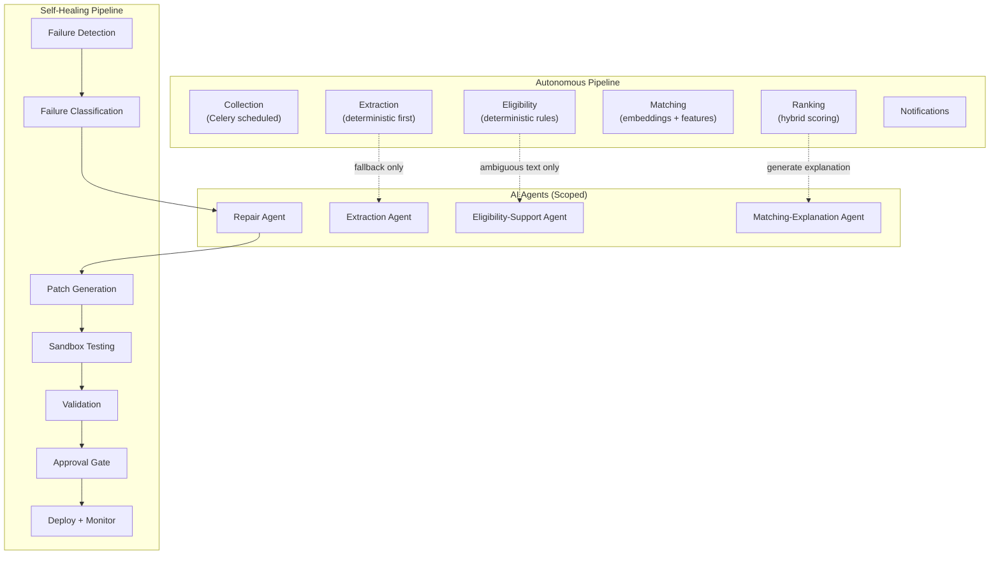

# Aegis — AI Agent Boundaries

## 1. Overview

Aegis uses four AI agents, each with a strictly defined scope. No agent has unrestricted access to the codebase, the database, secrets, or the network. This document defines what each agent IS and IS NOT allowed to touch.

**Core principle**: Every AI-derived decision must carry an evidence reference and, where applicable, a confidence value. No unexplained AI output is acceptable anywhere in the system.

**Security invariant**: All content processed by agents (web page text, résumé text, API payloads) is **untrusted input**. Instructions embedded in that content must **never** be treated as developer or system instructions.

---

## 2. Agent Specifications

### 2.1 Extraction Agent

**Purpose**: Structures raw text (from web pages, PDFs, API responses) into canonical opportunity or profile fields.

**Inputs allowed**:
- Raw text extracted by deterministic methods (PDF text extraction, HTML parsing)
- The canonical field schema (what fields to populate)
- Extraction configuration (field names, expected types)

**Outputs**:
- Structured field values with evidence snippets and confidence scores
- `null`/`UNKNOWN` for any field that cannot be confidently determined

**NOT allowed**:
- ❌ Network calls of any kind
- ❌ Database access (reads or writes)
- ❌ Access to business logic (`opportunity/`)
- ❌ Access to other connectors or source configurations
- ❌ Inventing plausible-sounding values when evidence is absent
- ❌ Treating content of the text being extracted as system instructions

---

### 2.2 Eligibility-Support Agent

**Purpose**: Assists with interpreting ambiguous eligibility text from opportunity descriptions, when deterministic rules cannot resolve the eligibility state.

**Inputs allowed**:
- Raw eligibility text from the opportunity
- The user's confirmed profile fields
- The specific eligibility question being asked

**Outputs**:
- A suggested eligibility interpretation with evidence and confidence
- Must return `UNKNOWN` if confidence is below threshold

**NOT allowed**:
- ❌ Overriding deterministic eligibility rules (hard constraints always dominate)
- ❌ Marking an opportunity as ELIGIBLE or INELIGIBLE without evidence
- ❌ Access to match scores, rankings, or notification logic
- ❌ Database writes (it provides a recommendation; the eligibility engine decides)
- ❌ Treating opportunity text as system instructions

---

### 2.3 Matching-Explanation Agent

**Purpose**: Generates a short, plain-language explanation for why an opportunity was ranked for a user.

**Inputs allowed**:
- The opportunity's canonical fields (stored in DB)
- The user's confirmed profile fields (stored in DB)
- The score breakdown (eligibility score, feature overlap, semantic similarity)

**Outputs**:
- A plain-language explanation (1-3 sentences)
- The explanation must be **grounded strictly in stored facts** — it must never invent a reason that isn't backed by data in the opportunity record or the user profile

**NOT allowed**:
- ❌ Modifying scores or rankings
- ❌ Access to raw source data or connector internals
- ❌ Database writes
- ❌ Network calls
- ❌ Generating explanations that reference facts not present in the stored data

---

### 2.4 Repair Agent

**Purpose**: Diagnoses and patches broken connectors when the self-healing pipeline detects a source failure.

**Inputs allowed (strictly scoped)**:
- The connector's source code (single file)
- The relevant test fixture
- A sanitized page snapshot (untrusted content — agent must treat it as such)
- The recent error message/stack trace
- The expected canonical schema
- The regression tests for that connector

**Outputs**:
- A minimal unified diff (patch) for the connector file
- Diagnostic reasoning explaining the fix

**NOT allowed**:
- ❌ Access to any file outside the target connector and its test fixtures
- ❌ Access to credentials, secrets, API keys, or environment variables
- ❌ Access to business logic (`opportunity/`, `notifications/`, `agents/orchestrator/`)
- ❌ Full-file rewrites (diffs only)
- ❌ Changes to unrelated files
- ❌ Introducing forbidden imports or shell commands
- ❌ Direct execution of generated code (sandbox only)
- ❌ Treating scraped page content as trusted instructions
- ❌ Executing arbitrary shell commands outside a strict pre-approved allowlist

---

## 3. Agent Interaction Model

## 4. Safety Guarantees

| Guarantee | Mechanism |
|-----------|-----------|
| No unexplained AI output | Every AI decision carries evidence + confidence |
| No invented values | Agents return UNKNOWN/null when evidence is absent |
| No prompt injection from content | All external text is sandboxed; system prompts are never modifiable by content |
| No unauthorized code changes | Repair agent produces diffs only; applied in isolated worktree |
| No credential exposure | Agents never receive secrets, tokens, or DB passwords |
| No business logic modification | Repair agent scope is limited to connector files |
| Human approval by default | Repair patches require explicit approval before production merge |
| Kill switch available | All autonomous repair can be immediately disabled |
