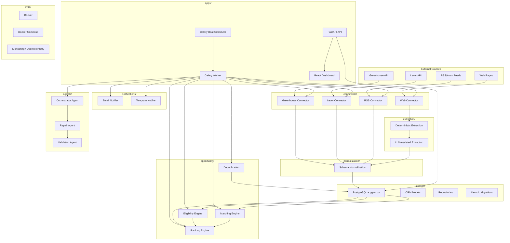

# Aegis — System Architecture

## 1. Overview

Aegis is a layered, autonomous opportunity-intelligence platform. The architecture enforces strict separation between data acquisition (connectors), data processing (extraction, normalization), business logic (eligibility, matching, ranking, deduplication), user-facing services (API, notifications, dashboard), and self-healing (agents).

## 2. Layer Descriptions

### 2.1 External Sources
External data providers. Aegis never scrapes sources whose terms disallow automated access, never bypasses CAPTCHAs or logins.

### 2.2 Connectors Layer (`connectors/`)
**Principle: Connectors are "dumb."** They only return raw/structured source data plus metadata. They implement a uniform interface (`fetch()`, `normalize_raw()`, `health_check()`). All business logic lives in `opportunity/`.

This isolation is what makes self-repair safe — the repair agent can be scoped to touch one connector file, never the business logic.

**No dependency on `opportunity/` is permitted.** Data flows strictly one-way: `connectors/ → normalization/ → opportunity/`.

### 2.3 Extraction Layer (`extraction/`)
Two-stage extraction with strict priority order:
1. **Deterministic** (`extraction/deterministic/`): Structured data (JSON-LD), CSS/XPath selectors, PDF text extraction.
2. **LLM-Assisted** (`extraction/llm/`): Last-resort fallback only. LLM never invents values; unknown fields are stored as `null`/`UNKNOWN`.

### 2.4 Normalization Layer (`normalization/`)
Converts raw connector output into the canonical `Opportunity` schema. Handles date normalization (timezone-aware, UTC), skill alias resolution, and field validation.

### 2.5 Opportunity Layer (`opportunity/`)
Core business logic. **No circular dependency with `connectors/`.**

| Sublayer | Responsibility |
|----------|---------------|
| `eligibility/` | Deterministic rule engine for hard constraints (degree, year, branch, team size, location, deadline). Output: ELIGIBLE / INELIGIBLE / UNKNOWN + evidence. |
| `matching/` | Sentence Transformers embeddings + pgvector similarity search. Structured feature overlap scoring. |
| `ranking/` | Hybrid scoring: hard eligibility filters + structured overlap + semantic similarity. Transparent, configurable weights. Full breakdown stored. |
| `dedup/` | Content-hash and semantic deduplication across sources. |

### 2.6 Storage Layer (`storage/`)
- **PostgreSQL 15+** with **pgvector** extension for embedding storage and similarity search.
- **Alembic** for versioned, reversible migrations.
- Repository pattern for data access.

### 2.7 Notifications Layer (`notifications/`)
- **Email** (SMTP/Gmail API) — mandatory MVP channel.
- **Telegram** — optional, behind feature flag.
- **In-app** — WebSocket/SSE push, backed by PostgreSQL.
- Idempotency key: `user_id + opportunity_id + meaningful_version_hash`.

### 2.8 Applications Layer (`apps/`)
| Component | Technology | Purpose |
|-----------|-----------|---------|
| `api/` | FastAPI | REST API with Pydantic v2 schemas, health checks, CORS, auth |
| `worker/` | Celery + Redis | Async task execution, retries, backoff, dead-letter |
| `scheduler/` | Celery Beat | Autonomous scheduling, per-source cadence configuration |
| `dashboard/` | React + TypeScript | Feed, Saved, Sources, Profile, Notifications, System Health |

### 2.9 Agents Layer (`agents/`)
AI agents with strict tool boundaries (see `docs/AGENTS.md` for full specification).

| Agent | Scope | Restrictions |
|-------|-------|-------------|
| Extraction Agent | Structures raw text into canonical fields | No access to business logic, no network calls |
| Eligibility-Support Agent | Assists with ambiguous eligibility text | Cannot override deterministic rules |
| Matching-Explanation Agent | Generates plain-language explanations | Grounded only in stored facts |
| Repair Agent | Diagnoses and patches broken connectors | Scoped to single connector file + fixture + error; no secrets, no repo-wide access |

### 2.10 Infrastructure Layer (`infra/`)
- **Docker Compose**: One-command local stack (API, worker, scheduler, Postgres, Redis, frontend).
- **Monitoring**: OpenTelemetry tracing, Prometheus/Grafana or structured logs.
- **CI/CD**: GitHub Actions — lint, type-check, test, build on every push.

## 3. Data Flow — Autonomous Pipeline

```mermaid
flowchart LR
    A["Celery Beat\n(Schedule Trigger)"] --> B["Connector.fetch()"]
    B --> C["Raw Snapshot Storage\n(content hash + timestamp)"]
    C --> D["Extraction\n(deterministic → LLM fallback)"]
    D --> E["Normalization\n(canonical Opportunity schema)"]
    E --> F["Eligibility Engine\n(deterministic rules)"]
    F --> G["Embedding Generation\n(Sentence Transformers)"]
    G --> H["Matching\n(pgvector similarity)"]
    H --> I["Ranking\n(hybrid scoring)"]
    I --> J["Deduplication\n(idempotency check)"]
    J --> K["Notification Dispatch\n(email / telegram / in-app)"]
```

**Key invariant**: This entire pipeline runs autonomously on schedule. The user's only required actions are initial profile setup, adding/removing sources, and reviewing notifications.

## 4. Dependency Rules

| Source Module | May Depend On | Must NOT Depend On |
|--------------|---------------|-------------------|
| `connectors/` | `core/`, `storage/` | `opportunity/`, `agents/`, `notifications/` |
| `extraction/` | `core/` | `opportunity/`, `connectors/`, `agents/` |
| `normalization/` | `core/`, `extraction/` | `opportunity/`, `connectors/` |
| `opportunity/` | `core/`, `storage/`, `normalization/` | `connectors/` (no circular dep) |
| `notifications/` | `core/`, `storage/`, `opportunity/` | `connectors/`, `agents/` |
| `agents/` | `core/`, `connectors/` (read-only source), `storage/` | `opportunity/` (agents don't touch business logic) |
| `apps/` | All layers (orchestration point) | — |

## 5. Technology Stack Summary

| Layer | Technology |
|-------|-----------|
| Backend API | Python 3.11+, FastAPI, Pydantic v2 |
| Database | PostgreSQL 15+ |
| Vector Search | pgvector extension |
| Queue / Scheduler | Celery + Redis |
| Web Crawling | Crawl4AI + Playwright (fallback only) |
| Embeddings | Sentence Transformers |
| Local LLM | Ollama (Gemma / Qwen / DeepSeek) |
| Frontend | React + TypeScript |
| Testing | Pytest, Playwright test runner |
| CI/CD | GitHub Actions |
| Containers | Docker Compose |
| Observability | OpenTelemetry; Prometheus/Grafana |
| Notifications | SMTP/Gmail API, optional Telegram Bot API, WebSocket/SSE |
