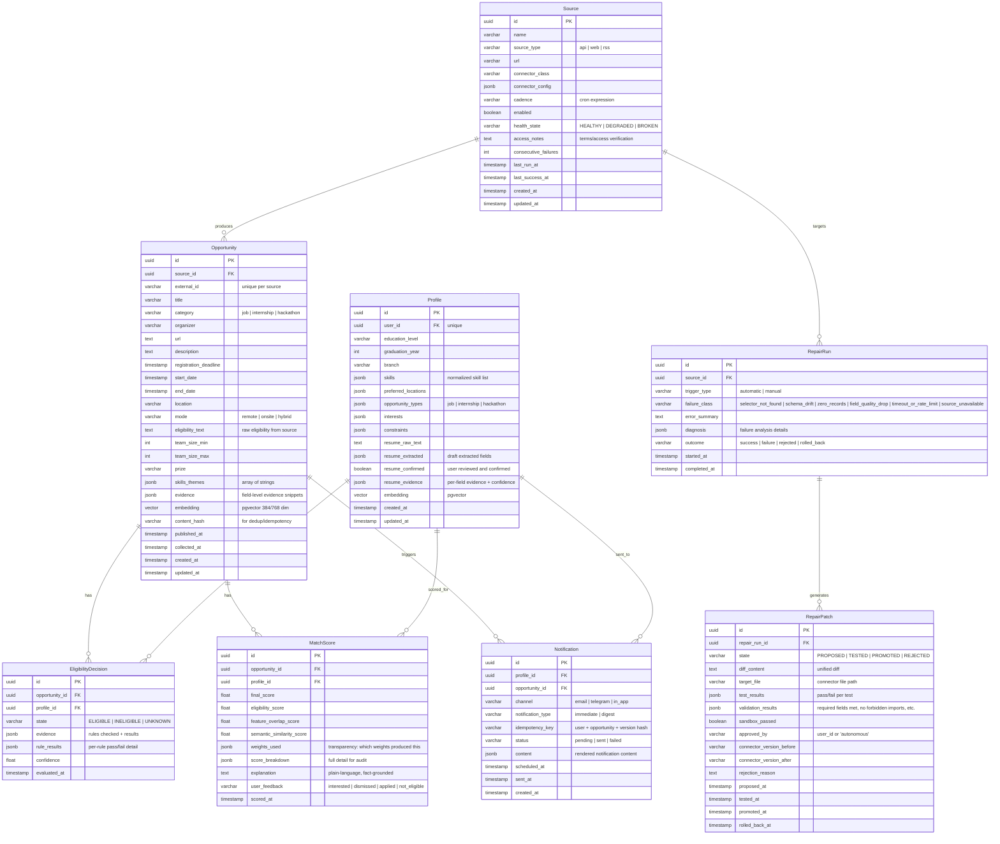

# Aegis — PostgreSQL Data Model

## 1. Entity-Relationship Diagram

## 2. Entity Descriptions

### Source
Represents a configured data source (API endpoint, web page, RSS feed). Stores connector configuration, scheduling cadence, and health state. Health transitions automatically based on consecutive run outcomes.

**Unique constraint**: `(source_type, url)` — prevents duplicate source registrations.

### Opportunity
The canonical opportunity record. All connectors normalize their output into this schema. Contains the pgvector embedding for semantic search.

**Unique constraint**: `(source_id, external_id)` — prevents duplicate opportunities per source.
**Index**: GiST index on `embedding` for pgvector similarity queries.

### Profile
User profile constructed from manual input and résumé extraction. The `resume_confirmed` flag gates whether extracted data is treated as authoritative. Contains a pgvector embedding for matching.

**Unique constraint**: `(user_id)` — one profile per user.

### EligibilityDecision
Records the eligibility evaluation of a specific opportunity for a specific profile. State is always ELIGIBLE, INELIGIBLE, or UNKNOWN — never inferred without evidence.

**Unique constraint**: `(opportunity_id, profile_id)` — one decision per opportunity-profile pair (latest wins, history in audit log).

### MatchScore
Stores the full hybrid scoring breakdown for an opportunity-profile pair. Includes the plain-language explanation and optional user feedback.

**Unique constraint**: `(opportunity_id, profile_id)` — one score per pair.

### Notification
Tracks every notification event. The `idempotency_key` prevents duplicate notifications for the same unchanged opportunity.

**Unique constraint**: `(idempotency_key)` — absolute dedup guarantee.

### RepairRun
Audit record for a single self-healing attempt on a source. Captures the failure classification, diagnosis, and final outcome.

### RepairPatch
The specific code patch proposed during a repair run. Tracks its lifecycle through PROPOSED → TESTED → PROMOTED/REJECTED, with full test and validation results.

## 3. Enumerations

| Enum | Values | Usage |
|------|--------|-------|
| `EligibilityState` | `ELIGIBLE`, `INELIGIBLE`, `UNKNOWN` | EligibilityDecision.state |
| `SourceHealth` | `HEALTHY`, `DEGRADED`, `BROKEN` | Source.health_state |
| `RepairState` | `PROPOSED`, `TESTED`, `PROMOTED`, `REJECTED` | RepairPatch.state |
| `OpportunityCategory` | `job`, `internship`, `hackathon` | Opportunity.category |
| `OpportunityMode` | `remote`, `onsite`, `hybrid` | Opportunity.mode |
| `NotificationChannel` | `email`, `telegram`, `in_app` | Notification.channel |
| `NotificationType` | `immediate`, `digest` | Notification.notification_type |
| `FailureClass` | `selector_not_found`, `schema_drift`, `zero_records`, `field_quality_drop`, `timeout_or_rate_limit`, `source_unavailable` | RepairRun.failure_class |
| `UserFeedback` | `interested`, `dismissed`, `applied`, `not_eligible` | MatchScore.user_feedback |

## 4. Key Design Decisions

1. **pgvector for embeddings**: Embeddings stored alongside relational data in PostgreSQL, avoiding a separate vector database. Uses GiST indexing for approximate nearest neighbor search.

2. **Content hashing for idempotency**: `Opportunity.content_hash` and `Notification.idempotency_key` enforce that re-crawls and re-notifications are no-ops for unchanged data.

3. **Evidence-first design**: Every AI-derived field (eligibility, match score, explanation) carries explicit evidence references. No unexplained AI output.

4. **Audit trail for repairs**: `RepairRun` + `RepairPatch` provide a complete, queryable audit trail for every self-healing attempt, successful or not.

5. **All timestamps timezone-aware, stored in UTC**: Consistent across all entities.
